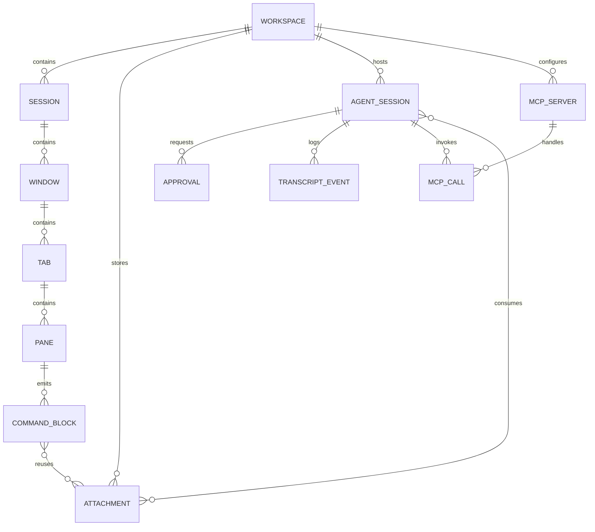
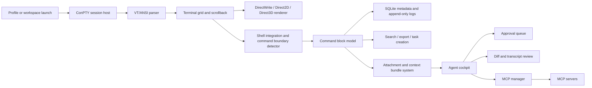
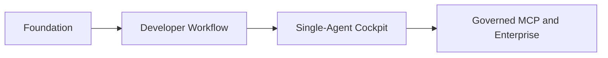

# Deep Research Report on the Native Windows Developer Terminal Concept

## Executive Summary

The Markdown file describes an unusually ambitious product: a **native Windows developer terminal** that combines a ConPTY-based terminal core, Windows 11 glassmorphism, Windows Terminal-compatible settings concepts, tmux-style multiplexing, structured command blocks, Markdown review, local shell intelligence, attachment-aware workflows, a visible/steerable CLI-agent cockpit, MCP management, and a Windows-focused command-learning system. It is explicitly positioned as a **real terminal first**, not an IDE replacement, not a generic Electron app, and not a cloud-required AI wrapper. fileciteturn2file0

Commercially, the concept is **plausible and differentiated**, but only if it is narrowed into a sharp wedge: **the safest, most native Windows terminal for agent-assisted development**. The underlying demand signals are real. In Stack Overflow’s 2025 survey, Windows was the primary OS for **49.5% of professional developers**, **16.8%** reported Windows Subsystem for Linux as a primary professional OS environment, and **84%** of respondents were using or planning to use AI tools in development; among professional developers, **50.6%** used AI tools daily. At the same time, **66%** said their biggest AI frustration was solutions that are “almost right, but not quite,” which directly supports a product thesis built around visibility, approvals, diffs, and rollback. citeturn7search1turn7search3turn7search5

The competitive scan the user prioritized is revealing. **Warp** proves demand for command blocks, vertical tabs, native-feeling agent workflows, and enterprise controls; **T3 Code** proves there is demand for a multi-agent control plane with bring-your-own subscriptions; **Ghostty** proves the appeal of a fast, native, GPU-accelerated terminal, but it does not yet officially support Windows; **MobaXterm** proves enduring Windows demand for a bundled remote-computing toolbox; and **Windows Terminal** proves the baseline expectation for tabs, panes, GPU text rendering, profiles, and JSON-style settings on Windows. No single product in that set combines **Windows-native terminal correctness**, **structured command history**, **PowerShell/WSL learning**, **agent approvals**, **MCP governance**, and **document-review workflows** in one cohesive Windows-first surface. citeturn12search0turn12search13turn12search21turn10search0turn10search3turn17search0turn11search2turn11search11turn13search0turn13search4turn14search1turn14search2turn14search3

Technically, the concept is viable. Microsoft’s pseudoconsole APIs are designed exactly for this class of terminal host, with `CreatePseudoConsole` supported on **Windows 10 version 1809 and later**, and Microsoft documents that the host must create the pseudoconsole session and communication channels **before** spawning the child process. Windows 11’s Mica and Acrylic materials also map well to the proposed visual direction, with Mica specifically recommended for long-lived windows and designed with performance in mind, while Acrylic is positioned for transient surfaces such as flyouts and menus. That means the PRD’s “Windows 11 first, Windows 10 optional” stance is technically sound: terminal compatibility can extend to Windows 10, but the premium visual identity is inherently stronger on Windows 11. citeturn20search0turn20search11turn5search2turn20search1turn20search3turn20search15

The largest risk is **scope explosion**. The file currently describes what is effectively a fusion of **Ghostty’s native-performance thesis**, **Warp’s structured terminal UX**, **T3 Code’s agent orchestration**, **MobaXterm’s Windows remote-ops bundle**, and **Windows Terminal’s compatibility baseline**. That combination is powerful, but it is too much for a first serious release. The best product strategy is to ship in phases: first the terminal platform and command model, then the workflow layer, then a **single-agent, approval-centric cockpit**, then MCP governance and enterprise surfaces. fileciteturn2file0 citeturn11search11turn12search0turn12search13turn10search0turn13search0turn14search1

The current working name, **GlassTerm**, should also be replaced. A quick web check shows an existing macOS terminal project named “GlassTerm” and an iOS SSH client using the same name, which creates obvious collision risk even before a proper trademark search. citeturn15search1turn15search2

| Dimension | Assessment | Why |
|---|---|---|
| Product-market fit | **Promising niche** | Windows remains a major developer OS, WSL is common, and AI adoption is now mainstream, but baseline terminal functionality is already free, so the wedge must be stronger than “better terminal.” citeturn7search1turn7search3turn14search1 |
| Technical feasibility | **Strong** | ConPTY, GPU text rendering, Win32 title-bar customization, Mica, MSIX, DPAPI, and Windows Terminal precedent all support the core architecture. citeturn20search0turn20search11turn5search1turn5search2turn5search12turn14search1turn14search3 |
| Defensibility | **Moderate, but improvable** | The defensible layer is not raw terminal emulation; it is the combination of Windows-native ergonomics, visible agent safety, PowerShell/WSL learning, and enterprise-grade local-first governance. citeturn16search4turn16search13turn16search10turn19search0 |
| Business viability | **Good if phased** | Freemium/open-core plus paid Pro and Enterprise controls is more credible than trying to monetize the base terminal alone. Warp, Zed, and MobaXterm all show viable paid patterns around governance, usage, or pro tooling. citeturn21search0turn21search8turn21search11turn21search3turn21search10turn21search9 |
| Biggest risk | **Uncontrolled scope** | The PRD is currently broader than most successful v1 developer tools. fileciteturn2file0 |
| Recommended v1 posture | **Terminal-first, single-agent, local-first** | That approach aligns with the PRD’s own principles and with where the market pain appears sharpest. fileciteturn2file0 citeturn7search3turn16search4turn16search13 |

## Application Deconstruction

At its core, the proposed application is best understood as a **Windows-native command center** for modern development rather than “just” a terminal. The file defines four concrete user groups: Windows developers, agentic-workflow developers, Linux-to-Windows power users, and technical managers/reviewers. That is important because it means the product is not optimized only for shell power; it is also designed for **reviewability**, **context packaging**, and **governed automation**. The most distinctive part of the concept is the claim that the terminal remains the primary interaction model while higher-level surfaces—Markdown review, attachments, agents, MCP, and command learning—are layered around it rather than replacing it. fileciteturn2file0

The value proposition resolves into three stacked promises. First, it promises **native Windows performance** through Win32, ConPTY, Direct3D/Direct2D/DirectWrite, and Windows composition APIs. Second, it promises a **workflow upgrade** through command blocks, panes, sessions, command search, project/task/Git awareness, and Markdown preview. Third, it promises **safer agentic workflows** through visible state, approvals, steering, MCP permissions, secrets handling, transcripts, and diffs. Those three promises match real external patterns: Microsoft’s terminal stack validates the platform path, Warp validates structured command blocks and agent-native terminal UX, and official CLI-agent docs from Anthropic, OpenAI, Google, and Aider all show that modern coding agents can read code, edit files, run commands, and use tools—making visibility and policy surfaces a product necessity rather than a flourish. fileciteturn2file0 citeturn14search1turn12search0turn12search13turn2search0turn16search1turn16search10turn16search3

The file’s object model is coherent. A **Workspace** contains sessions, windows, tabs, panes, attachments, agents, MCP servers, and layouts; commands become structured **Command Blocks** with metadata; agents operate within a visible session model; and MCP is treated as a distinct governed subsystem with logs, health checks, permissions, and secrets. That is a good product architecture because it centers the reusable, inspectable unit not on “chat messages” but on **work artifacts**: commands, outputs, diffs, files, Markdown, and tools. fileciteturn2file0

The product’s most valuable end-to-end flow is not “ask AI a question.” It is: **run command → capture block → attach context → launch/steer agent → approve tool/file/shell actions → inspect diff/transcript → rerun/test/export/commit**. That flow maps cleanly to the external behavior of CLI agents today. Claude Code officially emphasizes codebase reading, file edits, tool integration, and explicit permissions; Codex CLI documents sandboxing and approvals; Gemini CLI explicitly uses a ReAct loop with built-in tools and local or remote MCP servers; and Aider emphasizes selective file context and repository mapping. In other words, the concept’s strongest flow is already aligned with how leading agents actually behave in the terminal. citeturn16search12turn16search4turn16search13turn16search9turn16search10turn16search3turn16search15

The following diagram captures the conceptual entity model implied by the PRD. It is a synthesis of the uploaded file’s workspace, command-block, agent, attachment, and MCP structures. fileciteturn2file0

| Product element from the file | Why it matters strategically | Product implication |
|---|---|---|
| Native terminal engine on ConPTY with GPU rendering | This is table stakes for replacing Windows Terminal instead of merely augmenting it. fileciteturn2file0 citeturn20search0turn14search1 | Terminal correctness, latency, and VT/TUI compatibility must outrank every AI feature. |
| Command blocks as first-class artifacts | Warp and JetBrains both validate demand for command-structured terminal output. fileciteturn2file0 citeturn12search0turn18search5 | The block model should become the backbone of search, export, prompt context, and rerun flows. |
| Workspace multiplexing and layouts | Windows Terminal, Warp, Ghostty, VS Code, and Zed all validate multi-context work as standard behavior. fileciteturn2file0 citeturn14search1turn12search21turn11search2turn18search0turn18search3 | Saved project layouts are valuable, but durable sessions should arrive only after core stability. |
| Attachment-aware context bundles | Aider, Claude Code, Codex, and Gemini workflows all benefit from precise, minimal, inspectable context. fileciteturn1file4 citeturn16search15turn16search12turn16search1turn16search10 | “What exactly is being sent?” should be a visible product primitive. |
| Command Lens for Windows and PowerShell learning | This is the sharpest feature-level differentiator because it serves a very Windows-specific pain point not central to Warp/Ghostty/T3. fileciteturn2file0 citeturn1search3turn1search7turn19search0turn19search2 | It should be in v1, not deferred. |

## Market Need and Competitive Landscape

The market case for this product is strongest when framed around a **high-intent Windows developer niche**, not around “all terminal users.” Two data points matter most. First, Stack Overflow’s 2025 survey still places Windows as the most-used primary OS among professional developers at **49.5%**, which is a large enough platform base to justify a Windows-first product. Second, the same survey shows that AI-assisted development is already mainstream, with **84%** of respondents using or planning to use AI tools and **50.6%** of professional developers using them daily. Combined with **16.8%** professional WSL usage and the widely reported frustration that AI tools are often “almost right,” the external data supports a product aimed at Windows developers who want both terminal power and AI governance rather than another opaque coding assistant layer. citeturn7search1turn7search3turn7search5turn6search3

At the macro level, the developer universe is clearly large enough for a specialized tool. SlashData estimates **48.4 million developers worldwide** as of Q3 2025, while GitHub says more than **150 million people** use the platform across more than **420 million projects**. Those are not the same denominator, and neither directly measures terminal-heavy Windows developers, but they do show that a premium dev-tool business does not need mass-market adoption to become meaningful. The more relevant commercial question is whether the product can win a high-value subset of Windows-first engineers, infrastructure users, and AI-heavy workflow adopters. citeturn8search5turn8search6

A scenario-based sizing model, using the public inputs directionally rather than as precise denominators, suggests a credible opportunity:

| Layer | Directional basis | Illustrative range | Confidence |
|---|---|---|---|
| Broad opportunity | Global developer population plus Windows’ leading position among professional respondents. citeturn8search5turn7search1 | **15M–25M** Windows-first or Windows-comfortable developers | Medium |
| Advanced CLI/WSL/automation subset | Windows primary OS, meaningful WSL penetration, and the product’s explicit focus on shell-heavy workflows. citeturn7search1turn6search3turn14search16 | **2M–6M** potential advanced users | Low-to-medium |
| AI-governed terminal beachhead | Daily AI adoption among pros plus dissatisfaction with opaque/incorrect AI output. citeturn7search3turn7search5 | **0.5M–2M** likely early-adopter segment | Low |
| Initial paid opportunity | Planning estimate based on premium dev-tool adoption patterns, not a public source | **25k–150k paid seats** | Low |

The prioritized-site competitive scan shows that the whitespace exists, but it also shows how easy it would be to drift into adjacent categories instead of building a focused product.

| Product | What the official product says | What it proves | Gap the proposed app can attack |
|---|---|---|---|
| **Warp** | Warp calls itself an “agentic development environment born from the terminal,” emphasizes command **Blocks** as the fundamental unit of terminal output, supports **vertical tabs** with rich metadata, offers agent workflows that feel native, and sells paid plans with governance/privacy controls. citeturn0search0turn12search0turn12search13turn12search21turn21search0turn21search11 | There is real demand for structured terminal UX, agent-native terminal workflows, and monetizable governance. | Warp is strong inspiration, but the concept can differentiate through **Windows-native visuals, PowerShell/WSL depth, local-first posture, and explicit MCP governance**. |
| **T3 Code** | T3 Code positions itself as an **open-source control plane for coding agents**, says users can orchestrate Claude Code, Codex, OpenCode, and Cursor from one surface, is free/open source, and offers Windows, macOS, and Linux downloads. The GitHub repo currently documents support for Codex, Claude, and OpenCode. citeturn10search0turn21search1turn10search3turn17search0 | Developers want a unifying surface for external agents and are comfortable with BYO subscriptions. | T3 Code is more of an orchestration GUI than a terminal foundation. The opportunity is to make the **terminal itself** the control plane. |
| **Ghostty** | Ghostty describes itself as **fast, feature-rich, and native**, with platform-native UI and GPU acceleration. Official docs highlight windows/tabs/splits and shell integration, but say **Windows support is planned for the future**. citeturn11search11turn11search0turn11search2turn11search10 | Native architecture and terminal performance matter enough to be a differentiator. | There is still room for a **native Windows** equivalent with strong developer workflow and governance features. |
| **MobaXterm** | MobaXterm positions itself as a Windows remote-computing toolbox with SSH, RDP, X11, SFTP, serial, tunnels, graphical SFTP, multi-execution, and portable deployment. The Pro edition starts at **$69/user** and emphasizes security/stability. citeturn13search0turn13search4turn21search9 | Windows users will pay for a convenience bundle that unifies terminal and remote-ops workflows. | The proposed app should learn from MobaXterm’s Windows pragmatism, but avoid becoming a legacy-style remote toolbox. |
| **Windows Terminal** | Microsoft describes Windows Terminal as a modern host for Command Prompt, PowerShell, and WSL/bash, with multiple tabs, panes, Unicode, GPU text rendering, themes, and profile-level JSON settings. Its GitHub repo is open source and includes Windows Terminal, conhost, and shared console components. citeturn14search1turn14search2turn14search3turn14search8 | Baseline expectations on Windows are already high and free. | v1 must differentiate beyond tabs/panes/themes—especially with **command structure, approvals, context packaging, and Windows command learning**. |
| **VS Code terminal** | VS Code documents split terminal groups, terminal profiles, shell integration, and advanced settings. citeturn18search0turn18search1turn18search8turn18search7 | Developers already have a competent integrated terminal inside their editor. | The concept must win as a **terminal-first** product, not an editor add-on. |
| **Zed and JetBrains trendline** | Zed now supports parallel agents, terminal threads, external agents such as Claude/Gemini CLI, and trusted worktrees; JetBrains’ terminal work includes command blocks and a reworked terminal engine. citeturn18search3turn18search14turn18search22turn18search10turn18search5turn18search9 | The market is converging on terminal-plus-agent-plus-structured-context experiences. | Generic “AI in the terminal” is no longer enough; the moat must be **Windows-native execution, safety, and clarity**. |

One important competitive conclusion follows from that table: **the biggest wedge is not glassmorphism**. The most defensible wedge is **Windows-native, reviewable, permission-scoped AI-assisted terminal work**. The visual system can help acquisition and brand, but it will not reliably retain users unless the product makes PowerShell, WSL, Git, and agent workflows materially safer and faster than free alternatives. fileciteturn2file0 citeturn14search1turn18search1turn16search4turn16search13

## Technical Architecture and Delivery Viability

The uploaded PRD’s technical direction is fundamentally sound. ConPTY is the correct Windows primitive for process hosting, and Microsoft’s documentation explicitly describes pseudoconsole hosting as a model where the hosting application creates the communication channels and pseudoconsole **before** creating the child process. Windows Terminal itself is proof that Microsoft’s modern terminal stack can support tabs, panes, themes, and GPU text rendering at production scale. The concept’s insistence that PTY I/O, parsing, grid mutation, and rendering remain isolated from agents, search, and settings is exactly the right architectural instinct. fileciteturn1file3 citeturn20search11turn20search0turn14search1turn14search3

The Windows-version assumptions are also reasonable. `CreatePseudoConsole` is supported on **Windows 10 1809+**, so a compatibility baseline on modern Windows 10 is technically feasible. But the desired visual identity leans heavily on Windows 11-era materials: Microsoft documents Mica as a Windows 11 material for long-lived windows, with Mica Alt available on Windows 11 version 22000+ and Windows App SDK 1.1+, while Acrylic is better suited to transient surfaces. That makes the file’s “Windows 11 first, Windows 10 optional” posture strategically correct: support Windows 10 where practical, but do not let Windows 10 constrain the premium UI model. citeturn20search0turn20search1turn20search3turn5search2turn5search22

A key technical tension lies in the agent layer. Official documentation across Claude Code, Codex CLI, Gemini CLI, and Aider shows that these tools do **not** expose identical capabilities, permission models, or tool surfaces. Claude Code emphasizes read-only defaults plus explicit permission escalation. Codex documents sandboxing and approval policies, and now has explicit Windows sandbox support. Gemini CLI documents ReAct-style flows using built-in tools plus local or remote MCP servers. Aider’s repository map and selective-file guidance imply a much more context-minimal, Git-grounded interaction style than generic chat. The product therefore should not try to normalize all agents into a fake common denominator; it should normalize only the **host-side observability model**: commands, files touched, approvals, tool calls, diffs, timestamps, and transcript events. citeturn16search4turn16search13turn16search21turn16search10turn16search3turn16search15

The core system data flow should look like this:

The architecture options below show why the PRD’s native stack is still the best fit, while also acknowledging viable alternatives.

| Stack option | Fit for this product | Advantages | Liabilities | Recommendation |
|---|---|---|---|---|
| **C++20 + Win32/C++/WinRT + DirectWrite/Direct2D/Direct3D + SQLite** | Highest | Best alignment with ConPTY, native input/rendering, custom title bar, Windows materials, low-level performance tuning, and the PRD’s “no Electron/WebView hot path” stance. fileciteturn1file3 citeturn20search0turn14search1turn5search2 | Slowest product iteration velocity; steepest hiring and maintenance curve. | **Recommended default** |
| **Rust + Win32 bindings + native GPU stack + SQLite** | High | Better memory safety, good performance, and strong affinity with the modern terminal/editor ecosystem; Codex CLI and Zed both reinforce that Rust can support high-performance AI/dev experiences. citeturn16search1turn21search14 | Windows-native UI polish and composition will still require serious platform expertise; lower leverage from Windows-native samples than C++. | **Best secondary option** |
| **C# / WinUI 3 shell + native terminal core DLL** | Medium | Fast UI iteration, easier settings/enterprise/admin surfaces, good accessibility tools. | Risk of split-brain architecture if the terminal core lives elsewhere; harder to maintain a deeply bespoke hot path. | Good for enterprise/admin-heavy variants, weaker for the base product |
| **Tauri or Electron shell with terminal embed** | Low | Fast cross-platform surface building. | Conflicts with the PRD’s explicit direction; likely weakens the “completely native Windows terminal” claim and undermines the performance thesis. fileciteturn2file0 | **Not recommended** |

The same kind of option analysis applies to Markdown preview, which the uploaded PRD leaves open. There are three plausible choices. A fully native renderer best protects brand coherence and dependency simplicity, but Mermaid, tables, images, and rich layout semantics raise implementation cost. A full browser-based renderer is fast to ship, but it dilutes the native thesis. A hybrid approach is the best compromise: keep the terminal hot path fully native, parse Markdown natively for indexing and review metadata, and use an **isolated non-hot-path rendering surface** only where rich document fidelity is needed. That does not violate the PRD’s terminal-first architecture, but it should be introduced carefully and only if the team accepts the complexity tradeoff. fileciteturn2file0

Scalability-wise, the PRD is strong in intent but light on hard numbers. It correctly calls for append-only logs, virtualized scrollback, dirty-region rendering, bounded workers, and inactive-tab suspension. Those are the right primitives. What is missing are explicit success thresholds: cold start time, memory ceiling per idle tab, maximum sustainable throughput for large outputs, and worst-case resize latency. Those numbers should be added to the PRD before implementation begins, because terminal products are often judged first on “feels instant” and only second on added features. fileciteturn2file0

## Legal, Security, and Business Viability

The privacy and regulatory profile is manageable **if** the product stays genuinely local-first by default. The file already moves in that direction by making cloud services, accounts, and AI optional and by keeping command history local by default. That is wise because once telemetry, hosted indexing, or cloud-agent execution enter the picture, the compliance surface grows quickly. The EU’s GDPR governs how EU personal data is processed and transferred, and the European Data Protection Supervisor defines **data minimisation** as collecting only the personal data that is directly relevant and necessary for a stated purpose, and keeping it only as long as needed. California’s CCPA applies only above specific business thresholds, including over **$25 million** in annual revenue, handling **100,000+** California residents’ or households’ personal information, or deriving at least **50%** of annual revenue from selling Californians’ personal information. A local-first default materially lowers exposure, though it does not eliminate it when cloud AI providers or team features are added. fileciteturn2file0 citeturn9search12turn9search8turn9search1turn9search13

Security is not an optional add-on here because the product’s core novelty is governed automation. MCP’s own documentation says clients **should** prompt for user confirmation on sensitive operations, show tool inputs before calling servers, validate tool results, use timeouts, and log tool usage; the security best-practices docs also frame MCP-specific attack vectors explicitly. That means the PRD’s insistence on permission prompts, tool-call display, audit logs, secret redaction, allowlists, provenance, and sandboxing is aligned with the protocol itself. Similarly, Claude Code’s official security guidance says additional actions beyond read-only access require explicit permission, and OpenAI’s Codex docs describe approvals and sandboxing as complementary controls. These external sources strongly reinforce the product thesis that visible approvals are not “friction”; on this class of product, they are part of the value proposition. fileciteturn2file0 citeturn4search4turn4search6turn4search24turn16search4turn16search13turn16search9

Distribution and packaging are also favorable to the concept. Microsoft positions **MSIX** as a modern and reliable Windows packaging format, which suits a product that may eventually need enterprise deployment and update trust. At the same time, Microsoft Defender SmartScreen is now a standard part of Windows’ trust posture for downloaded applications, so signing and reputation-building matter in practice even if they are not glamorous product work. The file’s inclusion of MSIX and signed updates is therefore correct and should stay. fileciteturn1file3 citeturn5search1turn5search5turn5search3

From an accessibility standpoint, the file is on the right path with screen readers, keyboard-only navigation, high-contrast mode, reduced motion, transparency toggles, and colorblind-safe themes. That maps well to the European accessibility context, where EN 301 549 is a major reference standard and is closely tied to WCAG 2.1 principles. This matters because glassmorphism, translucency, and motion-heavy polish can quickly undermine accessibility unless the defaults are explicitly guardrailed. The PRD already acknowledges that readability must outrank aesthetic flourish; that principle should be treated as binding, not aspirational. fileciteturn2file0 citeturn9search3turn9search7turn9search15

The licensing posture is favorable, but only if dependency discipline is strict. The file’s proposed Apache-2.0 default for the core is sensible. It is also useful that Windows Terminal’s repository is publicly available under MIT, because it provides a legitimate architectural reference point; however, the file is right to warn against copying proprietary branding, assets, or trade dress. MobaXterm’s plugin and source-license surfaces remind us that Windows convenience tools often accumulate a complex dependency graph over time, and agent/MCP bundling rights are especially important because those ecosystems are moving quickly. fileciteturn2file0 citeturn14search0turn14search3turn13search9turn13search5

On business model, the strongest path is **free/open core + paid Pro/Enterprise**, not “charge for the terminal itself.” Warp’s official pricing shows paid usage, governance, and enterprise controls around agentic workflows. T3 Code demonstrates the appeal of a free, MIT-licensed, bring-your-own-subscription model. MobaXterm demonstrates that Windows users will pay up-front for a serious pro bundle. Zed demonstrates a workable token/usage-based pro model for AI-heavy workflows. That points to a clean packaging strategy for this concept: keep the core terminal credible and widely adoptable, then monetize policy, governance, enterprise packaging, cloud conveniences, and advanced agent/MCP controls. citeturn21search0turn21search8turn21search11turn21search1turn10search3turn21search9turn21search3turn21search10

| Business layer | What to include | Why this is viable |
|---|---|---|
| **Community / open core** | Native terminal core, profiles, themes, panes, command blocks, search, basic shell intelligence, Markdown preview, basic agent launching via installed CLIs | The product needs credibility and adoption before it can monetize. T3 Code’s free/open-source posture and Windows Terminal’s free baseline make this almost mandatory. citeturn21search1turn14search1 |
| **Pro** | Advanced workspaces, agent approvals UX, worktree workflows, richer command intelligence, export bundles, advanced Markdown review, local MCP registry, premium themes | Prosumers will pay for workflow compression and safety, not for ANSI colors and tabs. The strongest line is “fewer mistakes, faster review, less context switching.” |
| **Enterprise** | SSO, device policy, audit trails, approved MCP catalogs, team policies, deployment tooling, controlled telemetry, configuration baselines, security review surfaces | Enterprise buyers care about governance, privacy, compliance, and rollout control. Warp’s enterprise positioning shows that those controls are monetizable. citeturn21search0turn21search19 |

The go-to-market sequence should match the product’s strengths. First, win a technical audience in **Windows-first dev communities**—PowerShell, WSL, .NET, game tools, infra, and developer productivity circles. Second, market directly to **agent-heavy developers** who already use Claude Code, Codex, Gemini CLI, or Aider but want more visible control. Third, package for teams that need a **local-first, policy-aware** alternative to pure cloud-agent environments. That is a better path than trying to out-market consumer AI coding IDEs head-on. fileciteturn2file0 citeturn16search12turn16search1turn16search10turn2search3turn6search3

## Risks, Gaps, and PRD Expansion

The single biggest risk is that the file currently combines **too many distinct product theses**. If everything ships at once, the team will compete simultaneously with Windows Terminal, Warp, T3 Code, Ghostty, MobaXterm, VS Code terminal, and emerging editor-agent surfaces from Zed and JetBrains. That is not a viable v1 strategy. The right move is to define a firm cut line: **native terminal + command blocks + workspaces + PowerShell/WSL learning + single-agent approvals**. Multi-agent orchestration, broad collaboration, cloud sessions, marketplace/discovery, and expansive plugin support should all come later. fileciteturn2file0 citeturn12search0turn10search0turn11search11turn13search0turn18search3turn18search5

There are also several concrete PRD gaps. The file is strong on architectural modules, but weaker on **nonfunctional thresholds** and **scope boundaries**. It omits hard budgets for startup, memory, and throughput. It names an optional session daemon but does not define the failure and recovery model deeply enough. It sensibly requires approval flows, but does not yet define how to prevent **approval fatigue**. It proposes an MCP manager, but the protocol itself is still evolving in enterprise-facing areas such as authorization and transport semantics, which argues for a cautious first release focused on local/workspace-scoped MCP rather than a broad discovery marketplace. Finally, the current working name should be retired because the web already shows clear “GlassTerm” reuse. fileciteturn2file0 citeturn4search21turn4search7turn4search19turn15search1turn15search2

| Risk or gap | Severity | Why it matters | Recommended response |
|---|---|---|---|
| Scope explosion | Critical | Broadest cause of schedule slip and quality failure | Lock a v1 cutline and publish explicit “not in first release” items |
| Terminal correctness regressions | Critical | A workstation terminal dies on emulation defects, not on missing AI features | Build a terminal-compatibility harness before agent features |
| Approval fatigue | High | Too many prompts will make users disable the core safety value | Use policy bundles, action grouping, and worktree isolation |
| MCP instability | High | Protocol and enterprise expectations are still maturing | Start with import/manual config and workspace-scoped servers only |
| Glassmorphism harming readability | High | Attractive screenshots will not compensate for poor daily use | Make opacity, blur, motion, and contrast controls first-class |
| Weak moat vs free tools | High | Tabs, panes, and themes already exist everywhere | Differentiate on Windows learning + visible agent governance |
| Naming collision | Medium | Risk to searchability and brand ownership | Rename before public launch |
| Plugin surface too early | Medium | Signing, permissions, and stability will slow the whole program | Defer general extensions until the core object model stabilizes |

The strongest prioritized improvement insights are these:

| Priority | Insight | Why it should be prioritized |
|---|---|---|
| **P0** | Make **command blocks** the product spine | Warp and JetBrains validate the pattern, and the uploaded PRD already makes blocks central. Everything else—search, export, AI context, reruns, bug reports—should build on that unit. fileciteturn2file0 citeturn12search0turn18search5 |
| **P0** | Treat **Command Lens** as a category-defining Windows wedge | PowerShell help, aliases, and Linux-to-PowerShell analogies are unusually relevant to Windows users and weakly served by cross-platform terminals. fileciteturn2file0 citeturn1search3turn1search7turn19search0turn19search2 |
| **P0** | Ship **single-agent workflows** before multi-agent orchestration | T3 Code and Warp show multi-agent appeal, but a terminal product should first perfect one visible, governed agent loop. citeturn10search0turn12search13turn12search19 |
| **P1** | Use **Git worktrees** as the safety primitive for agents | It dramatically lowers rollback anxiety and helps justify approvals, diff review, and isolated changes. Zed’s trusted worktree model and the PRD’s worktree flow support this direction. fileciteturn2file0 citeturn18search10turn18search3 |
| **P1** | Keep MCP **manual and inspectable** in early releases | MCP is valuable, but the product’s trust story depends on visible provenance, permission prompts, and logs. citeturn4search4turn4search6turn4search24 |
| **P1** | Keep the app **real-terminal-first** in onboarding and packaging | Competing against free baselines means the app must earn trust as a terminal before asking users to adopt its higher-level workflow model. fileciteturn2file0 citeturn14search1turn18search0 |
| **P2** | Do Markdown review, but keep it **review-oriented**, not editor-oriented | It is a useful differentiator for specs, docs, prompts, and runbooks, but a full editor would dilute the product. fileciteturn2file0 |
| **P2** | Consider remote-ops features as an **optional module or later expansion** | MobaXterm proves the value, but remote desktop/X11/tunnels are a different product center of gravity. citeturn13search0turn13search4 |
| **P3** | Defer cloud collaboration and team knowledge sync | These features are monetizable later, but they expand privacy, compliance, and support burden too early. citeturn21search17turn21search19 |

The current name should be replaced. A preliminary web scan shows live use of **GlassTerm** by other terminal-related products, so even if legal clearance might still be possible in some classes or regions, it is strategically weak. citeturn15search1turn15search2

| Proposed name | Rationale | Positioning note |
|---|---|---|
| **MicaForge** | Connects directly to Windows 11 visual language and the product’s “builder” identity | Strong Windows-first signal; premium feel |
| **ForgePTY** | Evokes pseudoconsole/PTY infrastructure and hands-on developer credibility | More technical and developer-native |
| **PaneForge** | Highlights splits, layouts, and workstation composition | Good if the workspace model is core to branding |
| **Threadline** | Suggests terminal lines plus agent threads and workstreams | Good for a modern, AI-aware identity |
| **Command Harbor** | Conveys safe docking, review, and control | Strong if safety/governance is the main wedge |
| **VectorDock** | Suggests precision, docking, and Windows-native layouting | More productized and enterprise-friendly |
| **Northshell** | Feels directional and stable without sounding generic | Good if the brand wants to feel broad and long-lived |
| **Worktree One** | Emphasizes isolated, reviewable engineering workflows | Strong if Git-safe agent workflows become central |

The expanded feature list below is structured to be immediately usable in a PRD. It converts the uploaded concept into a phaseable backlog with user stories, acceptance criteria, and rough complexity. The complexity estimates are my own planning judgments, not external facts. The feature set is grounded in the uploaded PRD and shaped by the competitive and technical evidence reviewed above. fileciteturn2file0 citeturn12search0turn14search1turn16search4turn16search13turn16search10

| Epic | Representative user story | Acceptance criteria | Rough complexity |
|---|---|---|---|
| **Terminal core and profiles** | As a Windows developer, I can launch PowerShell, CMD, WSL, Git Bash, SSH, and custom profiles with per-profile settings so I can replace Windows Terminal for daily work. | Profiles support executable, args, cwd, env, icon, title, theme override, font, safety mode; startup and shell switching are reliable; ANSI/VT, truecolor, bracketed paste, mouse reporting, OSC 8 links, Unicode, and alt-screen apps work on supported shells. | **XL** |
| **Renderer and scrollback** | As a power user, I can scroll, resize, and search large outputs without UI stalls. | GPU text rendering, dirty-region updates, virtualized scrollback, configurable retention, inactive-tab suspension, no synchronous disk I/O on hot path, stable behavior under high-output tests. | **XL** |
| **Workspace multiplexing** | As a full-stack developer, I can save a project layout with tabs, panes, and working directories and restore it later. | Horizontal/vertical splits, pane resize/move/zoom, pinned tabs, tear-out tabs, saved layouts, workspace templates, synchronized cwd support, restore after app restart; daemon-based reattach can be deferred. | **L** |
| **Shell integration and command blocks** | As a terminal user, I can treat each command and its output as a reusable object. | Supported shells emit command boundaries where possible; each block records command, cwd, timestamps, duration, exit code, branch, and output range; users can copy, rerun, export, bookmark, annotate, and attach blocks. | **L** |
| **Search and command palette** | As a reviewer, I can search commands, outputs, blocks, transcripts, tasks, and settings from one keyboard-first surface. | Search works across current pane, session, workspace, and persisted block metadata; filters like exit:nonzero, type:command, cwd:, branch:, agent: are supported; command palette covers terminal, workspace, Markdown, agents, MCP, Git, and diagnostics. | **M** |
| **Project, Git, and task awareness** | As a developer, I can see repo state and run discovered scripts or targets without leaving the terminal. | Project detectors resolve major manifest files, repo roots, monorepos, and worktrees; task runner discovers npm/pnpm/yarn, Make, Just, Task, Cargo, dotnet, Docker Compose; Git surface shows branch, dirty state, ahead/behind, diff preview, branch switch, and create worktree. | **M** |
| **Local shell intelligence** | As a Linux-to-Windows power user, I get zsh-like suggestions, syntax highlighting, typo correction, and directory jumping without cloud dependence. | Suggestions are deterministic and local; risky or destructive corrections never auto-run; existing vs missing paths are visibly distinct; secrets are suppressed; autojump index supports WSL and UNC paths; profile/workspace toggles exist. | **L** |
| **Command Lens** | As a PowerShell learner, I can press F1 on a command and get relevant help, aliases, examples, and Linux-to-PowerShell equivalents. | `Get-Help`, `Get-Command`, alias resolution, local CLI help, and offline cache work; `ls`, `dir`, and `gci` explain their mapping to `Get-ChildItem`; help opens contextually for current token; cached docs are searchable offline. | **M** |
| **Markdown review surface** | As a technical manager or spec author, I can preview, review, annotate, and hand off Markdown documents inside the workspace. | Source, preview, split, review, and diff modes work; tables, fenced code, GFM task lists, links, images, and Mermaid render or validate; comments and exported review summaries are supported; document can be attached to an agent. | **M** |
| **Attachments and context bundles** | As an agent user, I can attach exactly the files, blocks, diffs, logs, and screenshots I want—and see what the agent will receive. | Attachments support file/folder/diff/block/screenshot/log text; binary/large/secret-like files trigger warnings; context bundle manifest lists every included artifact; exports are reviewable before sending. | **M** |
| **Single-agent cockpit** | As a developer using Claude Code, Codex, Gemini CLI, or Aider, I can launch an agent from the terminal workspace and watch what it is doing in real time. | Agent selector supports local installed CLIs; sidebar shows status, cwd, current command, files touched, runtime, pending approvals, and transcript link; agents can be stopped, summarized, or steered; file changes are attributable and revertible. | **XL** |
| **Approvals and safety flows** | As a cautious engineer, I can approve or block risky shell commands, file writes, network access, and destructive operations. | Approval types are explicit and readable; policies can require confirmation for destructive commands and write/network operations; production safety mode displays visible warnings and theme overrides; approval audit log is exportable. | **L** |
| **Agent worktree workflow** | As a developer, I can spawn an agent in an isolated Git worktree, review its diff, run tests, and then merge or discard. | Create-worktree flow captures base branch, new branch, initial instruction, attached context, and target agent; diff, tests, and revert surface are one click away; cleanup is obvious and safe. | **M** |
| **MCP manager** | As a power user, I can install, inspect, scope, and monitor MCP servers without treating them as trusted by default. | Workspace/global scope is visible; install via JSON or explicit config import first; permissions, health, logs, provenance, version pinning, and secrets are shown; sensitive tool calls can require approval; destructive/external-write tools are blocked or confirmed. | **XL** |
| **Diagnostics, accessibility, and enterprise readiness** | As an IT/security stakeholder, I can deploy, validate, and govern the app in a predictable way. | MSIX/MSI packaging, signed updates, logs/diagnostics, high-contrast and reduced-motion support, keyboard-only flows, crash-safe storage, policy import/export, and dependency inventory are present; deeper enterprise controls can tier into paid plans. | **L** |

A sensible phased delivery model looks like this:

In practical terms, that means:

- **Foundation**: terminal core, profiles, renderer, panes/tabs, settings, theme system, command palette.
- **Developer Workflow**: shell integration, command blocks, search, Git/task/project detection, local shell intelligence, Command Lens.
- **Single-Agent Cockpit**: one-agent-at-a-time launch, approvals, diffs, transcripts, worktree isolation, attachments.
- **Governed MCP and Enterprise**: MCP install/inspect/health/logging, secrets, policy bundles, packaging, SSO/admin controls, team-level governance.

That phased plan is the strongest way to transform the uploaded concept from a visionary but overbroad PRD into a buildable product with a real chance of winning a valuable Windows developer niche. fileciteturn2file0 citeturn14search1turn16search4turn16search13turn4search4turn21search19